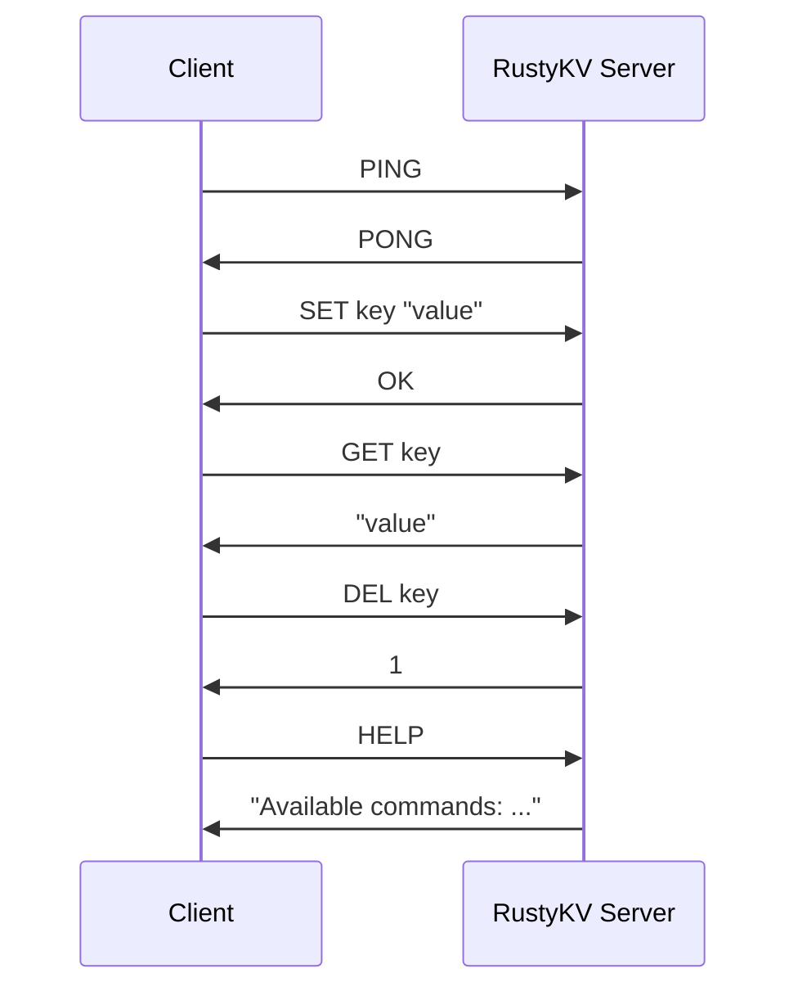
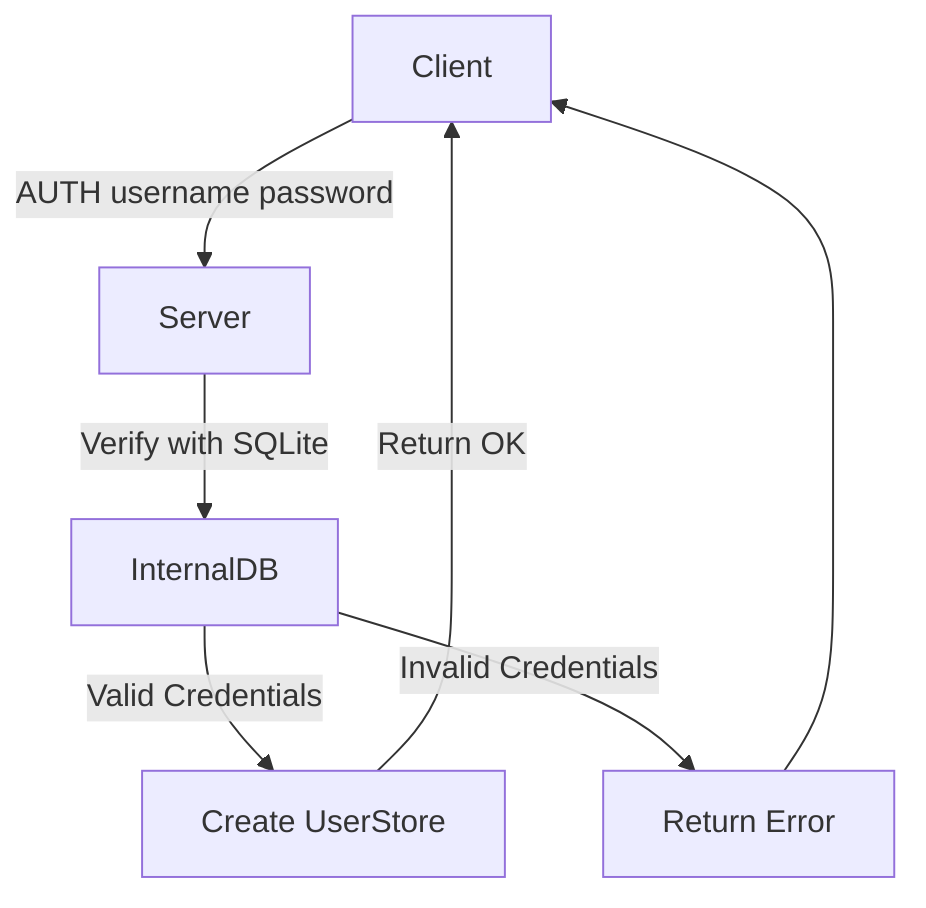
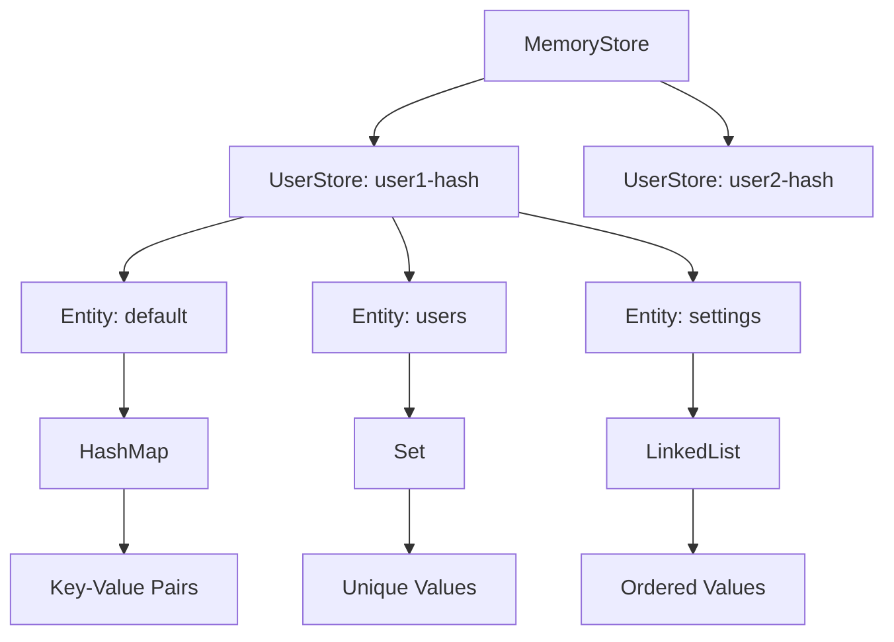
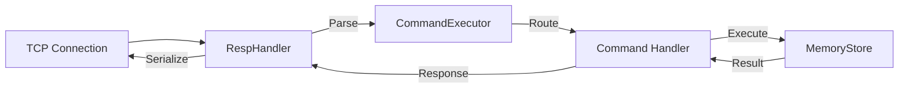

# 🚀 Rusty KV Store

A Redis-compatible key-value store server implementation written in Rust.

## 📖 Overview

Rusty KV Store is a lightweight Redis-compatible server that implements Redis
commands using Rust's async I/O capabilities with Tokio. This project aims to
provide a high-performance, memory-efficient alternative to Redis while
maintaining protocol compatibility.

## ✨ Features

- 🔄 TCP server implementation with async I/O
- 🔌 Redis protocol compatibility (RESP)
- 🏗️ Command handling architecture
- 💾 In-memory key-value storage with async access
- 📋 Currently implemented commands:
  - `PING` - Test server connectivity
  - `ECHO` - Echo back the provided message
  - `SET` - Set the value of a key
  - `GET` - Get the value of a key
  - `DEL` - Delete one or more keys
  - `HELP` - Display available commands

## ⚙️ How It Works 🔍

### 📊 RustyKV Client-Server Communication Diagram



1. **Client** sends a command to the **RustyKV Server**.
2. **RustyKV Server** processes the command.
3. **RustyKV Server** sends back the response to the **Client**.

## 💻 What is under the hood?

RustyKV implements a multi-tenant, authenticated in-memory key-value store with
SQLite persistence for user credentials. Let's dive into how it all works:

### 🔐 Authentication System

The server requires authentication before allowing access to data:

- User credentials (username/password) are stored in SQLite with Keccak256
  password hashing
- The `AUTH` command validates credentials against the database
- Upon successful authentication, a unique credential hash is generated and
  associated with a user-specific data store
- All subsequent commands from that connection operate within the user's private
  data space



### 📦 Memory Store Architecture

The `MemoryStore` implements a sophisticated multi-user data isolation system:

- **Top Level**: `MemoryStore` contains a map of user credential hashes to
  `UserStore` instances
- **User Level**: Each `UserStore` contains named entities (data structures)
- **Entity Level**: Each entity is a specific data structure (HashMap, Set,
  LinkedList)
- **Data Level**: The actual key-value pairs within each data structure

This layered approach provides:

1. Complete data isolation between users
2. Type-specific operations for different data needs
3. Thread-safety with `Arc`, `Mutex`, and `RwLock` primitives
4. Namespace organization with dot notation (e.g., `hashmap.key`)



### 🗄️ SQLite Database Usage

The `InternalDB` component provides:

- **User Authentication**: Stores usernames, password hashes, and account
  metadata
- **Persistence**: Ensures user credentials survive server restarts
- **Backup Functionality**: Configurable backup intervals and paths
- **Automatic Schema**: Creates required tables on startup

Database schema includes:

- `users` table with `id`, `username`, `password`, `created_at`, `updated_at`,
  and `root_user` columns

The server does NOT persist key-value data to the database - it's purely
in-memory, making operations extremely fast but volatile across restarts.

### 📝 RESP Protocol Implementation

RustyKV implements the Redis Serialization Protocol (RESP) for client-server
communication:

- **Value Types**: Supports all RESP data types (SimpleString, BulkString,
  Error, Integer, Array, Boolean, Null)
- **Parser**: Converts raw TCP byte streams into structured `Value` objects
- **Handler**: Manages reading/writing to TCP connections
- **Serializer**: Converts Rust objects back into RESP wire format

Example RESP encoding:

- Simple strings: `+OK\r\n`
- Bulk strings: `$5\r\nHello\r\n`
- Arrays: `*2\r\n$3\r\nGET\r\n$3\r\nkey\r\n`

### 🔄 Command Execution Flow

When a command arrives, it flows through the system:

1. **TCP Listener**: Accepts client connections
2. **RespHandler**: Reads and parses RESP-formatted data from the TCP stream
3. **CommandExecutor**: Routes commands to appropriate handlers
4. **Command Handlers**: Implement specific command logic (GET, SET, etc.)
5. **MemoryStore**: Executes the actual data operations
6. **RespHandler**: Serializes the response and writes it back to the client



### 🧰 Entity Types

RustyKV supports multiple data structure types:

1. **HashMap**: Traditional key-value mappings
   - Efficient lookups and updates
   - Used for general purpose storage
   - Default entity type for simple key-value operations

2. **Set**: Collection of unique string values
   - Efficient membership queries
   - Automatically deduplicates entries

3. **LinkedList**: Ordered sequence of values
   - Efficient insertions/deletions at both ends
   - Maintains insertion order

Each entity type implements common operations (get, set, delete) with
type-specific semantics, allowing for flexible data modeling within the
key-value store.

### ⚡ Performance Considerations

- **Concurrency**: Uses Rust's concurrency primitives for thread safety
- **Memory Efficiency**: Stores references where possible to reduce duplication
- **Async I/O**: Leverages Tokio for non-blocking I/O operations
- **Connection Pooling**: Uses r2d2 for database connection pooling

### 🔧 Configuration Management

The `Settings` module provides:

- TOML configuration file parsing
- Environment variable overrides
- Sensible defaults
- Dot notation access to nested settings
- Typed configuration retrieval

This allows RustyKV to be highly configurable without code changes.

### 🌉 From Command to Storage: A Complete Example

When a client issues `SET user:profile:name "John"`:

1. **TCP Stream**: Raw bytes arrive and are buffered
2. **RESP Parser**: Converts to
   `Value::Array([Value::BulkString("SET"), Value::BulkString("user:profile:name"), Value::BulkString("John")])`
3. **Command Executor**: Routes to `SetCommand::execute()`
4. **Authentication Check**: Verifies user is authenticated
5. **Storage Operation**: Writes to the user's default HashMap entity
6. **Response Generation**: Creates `Value::SimpleString("OK")`
7. **RESP Serialization**: Converts to `+OK\r\n`
8. **TCP Stream**: Sends bytes back to client

````
### 🖥️ Running the Server

```bash
# Run the server using cargo
make run-server
# or
cargo run --release
````

By default, the server listens on `127.0.0.1:6379`.

### 🔗 Connecting to the Server

You can use the standard Redis CLI or any Redis client to connect to the server:

```bash
# Connect to the server
rustykv-cli -h localhost -p 6379
# or
rustykv-cli -url kv://user:password@localhost:6379

# Or using socat
socat - TCP:localhost:6379

# Then type commands
PING
ECHO "Hello World!!"
SET key value
GET key
DEL key
HELP
```

## 💻 C++ CLI Client

A lightweight C++ CLI client is included to interact with the server directly.

### 🛠️ Building the CLI Client

The client requires the ICU (International Components for Unicode) libraries.

```bash
# Build the CLI client
make build-cli
```

This will compile the client and create a binary at `cli/tmp/main`.

### 🚀 Using the CLI Client

```bash
# Run the CLI client (builds it if needed)
make run-cli

# Connect to local RustyKV server (default: 127.0.0.1:6379)
./cli/tmp/main

# Connect to specific host
./cli/tmp/main 192.168.1.100

# Connect to specific host and port
./cli/tmp/main 192.168.1.100 7000
```

Once connected, you will see a prompt where you can type commands:

```
127.0.0.1:6379> SET mykey "Hello, RustyKV!"
127.0.0.1:6379> GET mykey
127.0.0.1:6379> DEL mykey
127.0.0.1:6379> PING
127.0.0.1:6379> HELP
```

To exit the client, type `exit` or `quit`.

### 🔄 Run Both Server and Client

You can start both the server and client in one command:

```bash
# Run both server and client in parallel
make run
```
